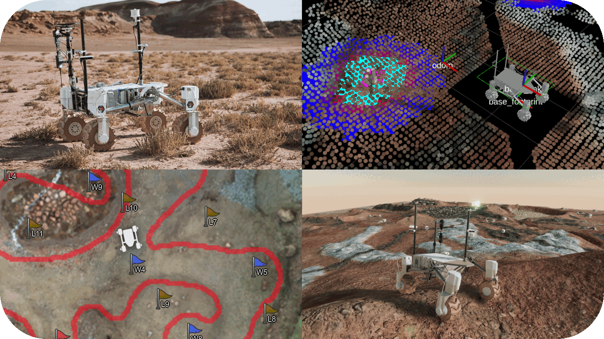

# Kalman

The software for AGH Space System's planetary rover



## Prerequisites

- [Spatio-Temporal Voxel Layer](https://github.com/SteveMacenski/spatio_temporal_voxel_layer) (Currently not available via rosdep and has to be built manually from source.) Required by `kalman_nav2`.
- the latest ROS 2 Rolling version of the [realsense-ros](https://github.com/IntelRealSense/realsense-ros) package which supports way more features and has a working (!) auto-exposure feature
- the latest commit of [rosbridge_suite](https://github.com/RobotWebTools/rosbridge_suite) which has support for ROS 2 actions. It is used in `kalman_gs` package.
- our custom version of [compressed_depth_image_transport](https://github.com/agh-space-systems-rover/compressed_depth_image_transport) that supports RVL compression and does not clash with `compressed_image_transport`'s params
- our custom version of [rtabmap_odom](https://github.com/agh-space-systems-rover/rtabmap_odom) that supports compressed image transports
- latest version of the [ros2 branch of moveit_msgs](https://github.com/moveit/moveit_msgs/tree/ros2)
- All Python packages listed in the `requirements.txt` files in the directories of some Colcon packages.
- All APT packages listed in the `apt_packages.txt` files in the directories of some Colcon packages.

## Getting Started

To make development quicker, the launch process of the development setup has been split into two separate launch files. One of them, suffixed `_sim_base`, launches the simulation environment and RViz. The other one, suffixed `_sim_stack`, launches the rest of the software stack, including localization, mapping, and navigation capabilities:
```bash
ros2 launch kalman_bringup urc_autonomy_sim_base.launch.py
# Before running the next command, make sure that the simulation is started and sensor messages are being published.
ros2 launch kalman_bringup urc_autonomy_sim_stack.launch.py
```
> [!NOTE]
> The commands shown above will launch the Unity simulation environment which requires additional installation.
> Please follow the instructions [here](https://github.com/agh-space-systems-rover/unity_sim#Getting-Started) in order to set up Unity.

In order to run on a physical rover, just one launch file is needed:
```bash
ros2 launch kalman_bringup urc_autonomy_rover.launch.py
```

To launch the ground station, use the following command on a separate machine:
```bash
ros2 launch kalman_bringup urc_autonomy_gs.launch.py
```
For certain features to work, the ground station should be connected to the same network as the rover and/or have our custom radio communication hardware connected to it.

Multiple other launch files are available in the `kalman_bringup` package, including the ones for other competitions and development purposes.

## Packages

Kalman's software stack is composed of multiple packages that are meant to be built and run together:
- `kalman_arm_*` - packages that power Kalman's 6DoF arm
- `kalman_aruco` - ArUco tags detection using aruco_opencv
- `kalman_bringup` - launch files for the rover and the ground station
- `kalman_clouds` - point cloud generation and filtering
- `kalman_description` - Xacro / URDF descriptions + models for the rover
- `kalman_drivers` - drivers for the physical hardware; only to be run separately from the simulation
- `kalman_interfaces` - ROS 2 messages, services and actions used by the other `kalman_` packages
- `kalman_master` - drivers for our custom Master device
- `kalman_nav2` - configuration and launch files for Nav2 and related modules; Includes a custom path follower.
- `kalman_robot` - a metapackage that depends on all other `kalman_` packages
- `kalman_slam` - configuration files for robot_localization and RTAB-Map
- `kalman_supervisor` - Manages autonomous navigation missions.
- `kalman_wheels` - a node that converts Twist messages on `/cmd_vel` and similar topics to the actual wheel state; Also includes safeguards that can limit the acceleration and velocity or stop the rover to adjust wheel rotation.
- `kalman_yolo` - **PRIVATE** models and configs for `yolo_ros`

## Sub-projects

- `joy_linux` - joystick_srivers/joy_linux with our modifications and improvements
- `point_cloud_utils` - utilities for working with point clouds; Includes ROS wrappers around PCL filters and an obstacle detection node.
- `service_based_nav2_controller` - a `FollowPath` controller plugin for Nav2 that uses a service to compute velocity commands
- `unity_sim` - a Unity-based simulation environment that can seamlessly replace the physical hardware of AGH Space Systems' robots
- `yolo_ros` - YOLO-based object detector; Supports composition and lifecycle management.

## Launch Hierarchy

Launch files are organized in a hierarchical manner. The `kalman_bringup` package contains main launch files that are meant to be the only ones used via `ros2 launch`. `kalman_bringup` includes many other launch files from other `kalman_` packages, which in turn may include even more launch files from other packages:


## Data Flow

All `kalman_` packages are designed to work together and exchange data in a complex manner. The following diagram shows a high-level overview of the data flow between top-level modules:


As mentioned in [Launch Hierarchy](#launch-hierarchy), top-level modules may include other modules that are not shown in the diagram. Each module contains a set of nodes that actually perform the data processing and exchange.

## Guidelines

- When committing new code, please follow the [Conventional Commits](https://www.conventionalcommits.org/en/v1.0.0/) specification.
- The `scripts` directory should only contain scripts that are meant to be installed as ROS executables.
- The `tools` directory should only contain developer utilities and not ROS-related code.
- Whenever possible, design your C++ nodes as components. See [this tutorial](https://docs.ros.org/en/iron/Tutorials/Intermediate/Writing-a-Composable-Node.html) for more information.
- If a dependency is not available in rosdep, please add it to the `apt_packages.txt` or `requirements.txt` file created next to `package.xml`. Always prefer rosdep over those files.

## Known Issues

- Nav2 (STVL) on random occasions when booting up, starts spamming TF errors and takes up 100% of the CPU. Issue is present both in simulation and on the physical rover.
