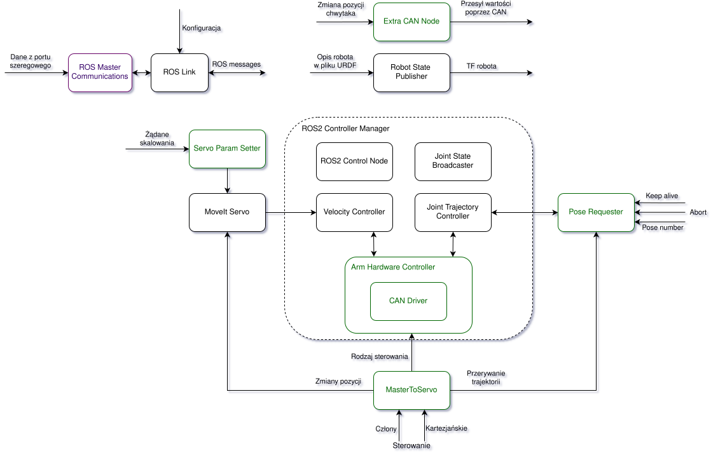

# Arm Controller

a set of nodes that use ROS2 Control and CAN to interface with joints and MoveIt controllers

## Description

The main element is the hardware controller, which is used by ROS2 control to interface with arm's joints using CAN FS protocol.

Additionally, there are some extra ROS nodes in the `scripts` directory. Those are used during development.

## Kalman's Arm Description

Here's a diagram of data flow between the arm's subsystems. Our custom nodes are colored in green:



(Excuse Polish language in the diagram.)

## Hardware-free CAN simulator

`arm_can_simulator` implements arm side of current SocketCAN protocol. It uses
same command/status IDs and packed wire structs as hardware driver, accepts CAN
FD frames, validates IDs, payload lengths, control-mode sequencing, and joint
position limits. It publishes `CMD_JOINT_FAST_STATUS` for all six joints at 50 Hz.

Create and start virtual CAN interface:

```sh
sudo modprobe vcan
sudo ip link add dev can0 type vcan # Skip if can0 already exists.
sudo ip link set up can0
```

Build and run simulator inside `kalman_ws` distrobox:

```sh
distrobox enter kalman_ws -- bash -lc \
  'source /opt/ros/humble/setup.bash && colcon build --packages-select kalman_arm_controller'
distrobox enter kalman_ws -- bash -lc \
  'source /opt/ros/humble/setup.bash && source install/setup.bash && ros2 run kalman_arm_controller arm_can_simulator can0'
```

Start regular arm controller in another terminal. Simulator models position mode
with configured position/speed limits and legacy mode from commanded velocity;
reported position and velocity therefore exercise same conversion and differential
joint paths as real controller. Invalid input is rejected on stderr, making CAN
protocol regressions visible without hardware.

Remove virtual interface when done:

```sh
sudo ip link delete can0
```
