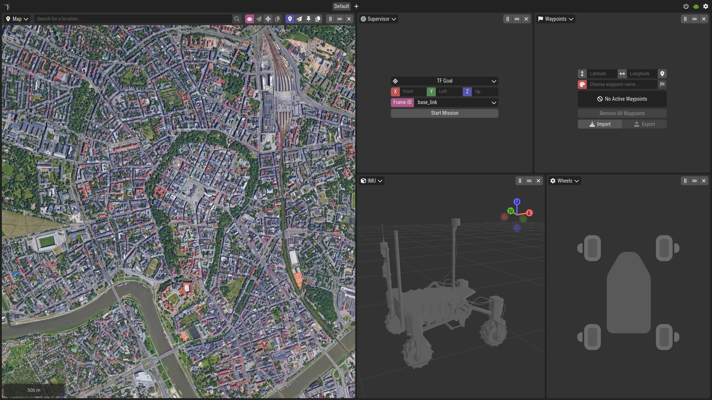
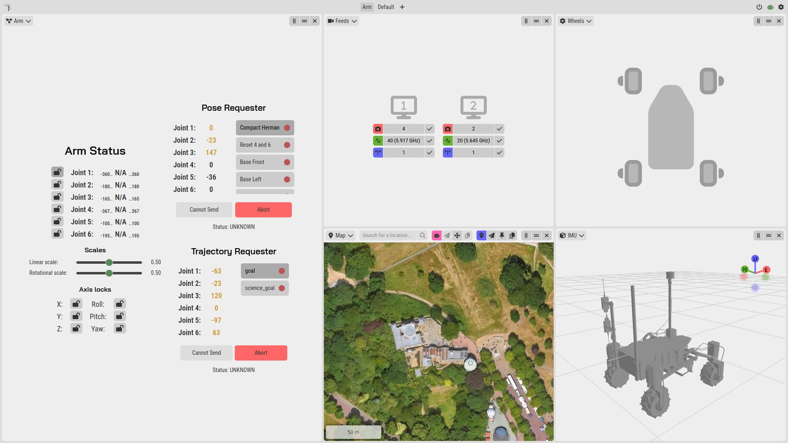
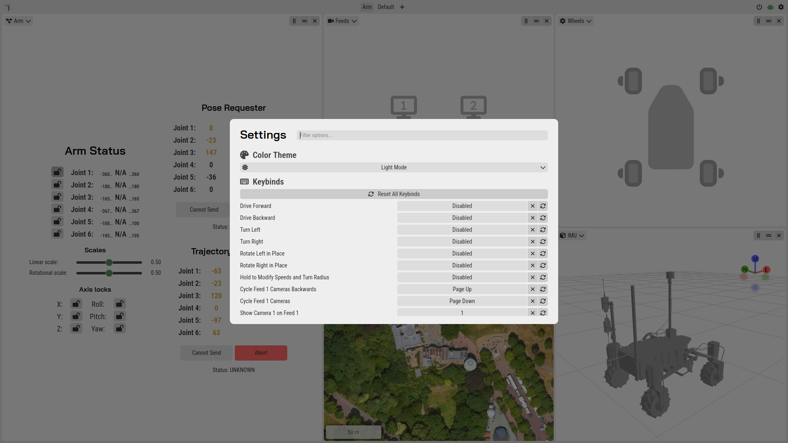

# kalman_gs

This package containts ground station project for maneuver and interaction with the Kalman rover. It also contains scripts to integrate node project into ROS.

## Prerequisites

- [Node.js and npm](https://nodejs.org/en/download/)
- Python packages from `requirements.txt` file

## Installation

You can safely run `ros2 launch kalman_gs gs.launch.py` file (after building project) to install and launch node project together with map server. Otherwise, run `npm install` to install the project and `npm start` to start the project.

> [!NOTE]
> `npm start` doesn't start map server and rosbridge. You need to start it manually.

## Overview

- Control the rover and see the data in convenient and readable way.
- Map of the environment.
- Settings to change display and shortcuts.
- High flexibility.

