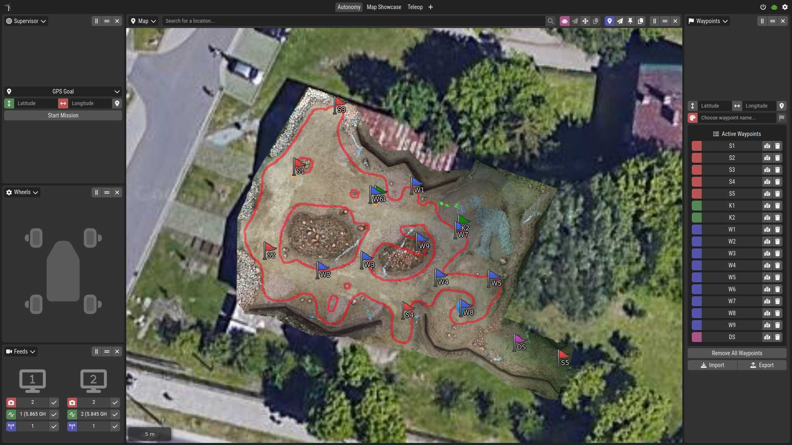
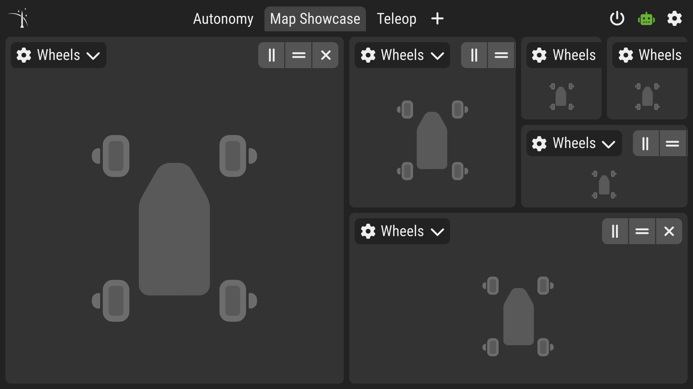
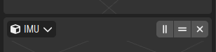
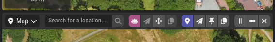
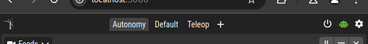
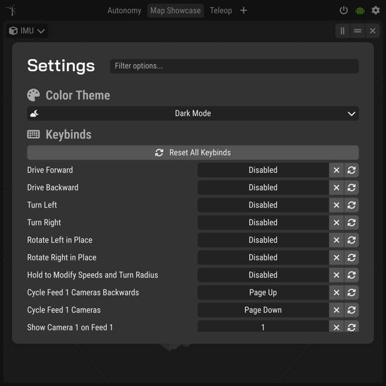
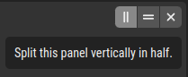

# Ground Station

ReactJS-based GUI for the rover



Quick standalone launch:

```bash
ros2 launch kalman_gs gs.launch.py
```

> [!NOTE]
> On first launch, the app might take a few minutes to start up, as NodeJS dependencies have to be installed.
> Wait until your web browser opens up with the ground station.
> If for some reason that does not happen, try opening `http://localhost:3000` manually, or run `npm install` in `./node_project` to see what's wrong.

## Interface Components

The main area of the interface is composed by the user themselves using a panel system. It is like a binary tree of panels, where each panel can be split into two panels vertically or horizontally. Each panel can display different type of information, like a map, chassis status, IMU readings, etc.



Every panel consists of a header, and a working area. The default header contains a dropdown menu that can change the panel's type, and buttons that allow to split in half or close the panel.



The working area is what the panel is all about - it can display a map, a chart, a table, etc.

Some panels extend this header with additional controls. Namely, the map uses this real estate to display a search bar and buttons to control the location marker.



Above the main panel area, there is a toolbar that allows to switch between user-defined layouts and to open the settings panel. It may additionally display custom indicators, like link status, detected controllers, etc.



When you click the settings button, an overlay with advanced application preferences will appear. Here you can change keybindings and the color scheme. In the future, more advanced settings will be added.



Lastly, the ground station aims to be self-documenting, so most buttons have useful tooltips attached to them. Just look around hovering your cursor over the buttons to learn more about the ground station's features.



## Adding New Features

The ground station is designed to be highly extensible through its modular architecture. There are several ways to add new capabilities:

#### Panels

The primary way to add new features is through custom panels. Each panel is a React component that can display any type of information or controls. To create a new panel:

- Add a React component in `./node_project/src/panels/`.
- Register it in `./node_project/src/panels/index.js`.
- The panel will automatically appear in the panel selection dropdown.

#### Other Extension Points

Other than adding new panels, you can extend the ground station through:

- Custom Panel Headers - Add specialized controls to your panel's header area.
- Toolbar Indicators - Display status information or quick actions in the top toolbar.
- Settings - Integrate new configuration options into the settings overlay.

## Technical Architecture

The ground station is served as a local web page, but is not powered by a backend server. Think of it as a desktop application, that just happens to run in a browser. All the logic you see on screen is implemented in JavaScript, which communicates directly with ROS 2, just like other programs like `rviz` or `rqt` would.

It consists of several key components working together:

- ReactJS frontend application located in `./node_project`
- ROS 2 node called `gs` that runs appropriate shell commands to start the frontend
- configs for MapProxy, a map caching service used by the fronted to work offline
- tile fetching utility `tools/fetch-tiles` that forces MapProxy to cache a certain geographical area by fetching all tiles contained within it
- the main launch file that starts `gs` along with MapProxy; it additionally starts `rosbridge_websocket`, which allows the ground station to communicate with ROS 2 from JavaScript
