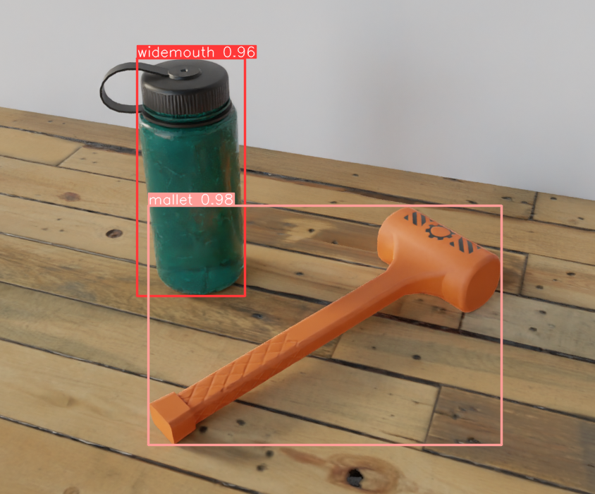

# YOLO-ROS

ROS 2 package that integrates YOLOv8 object detection as a node.

## Running The Detection

In order to run the YOLO detection node, a number of parameters must be provided, so ideally it should be started from a launch file. Refer to the launch files under the [launch directory](./launch) for example on how to do that. The name of the node is `yolo_detect` and all of its parameters are documented in the configuration files stored [here](./config).

The objects detected by the node are published on the `/yolo_detect/detections` topic as `vision_msgs/Detection2DArray` messages. Before publishing similar detections are merged together and then filtered temporally to eliminate flickering false positives. The node can also publish additional visualizations of the detections on the `/yolo_detect/annotatedX` and `/yolo_detect/markers` topics.

## Training a Model

Use the [`yolo-gym`](https://github.com/agh-space-systems-rover/yolo-gym) repository to train a model and export the PyTorch weight here to the `models` directory.
